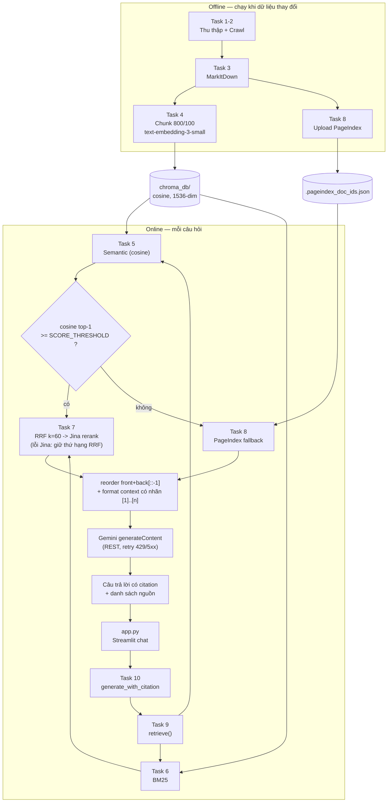
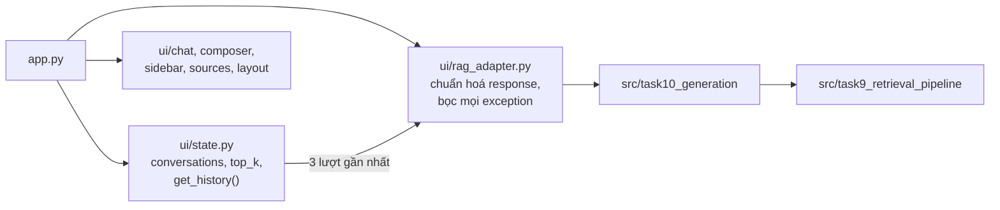
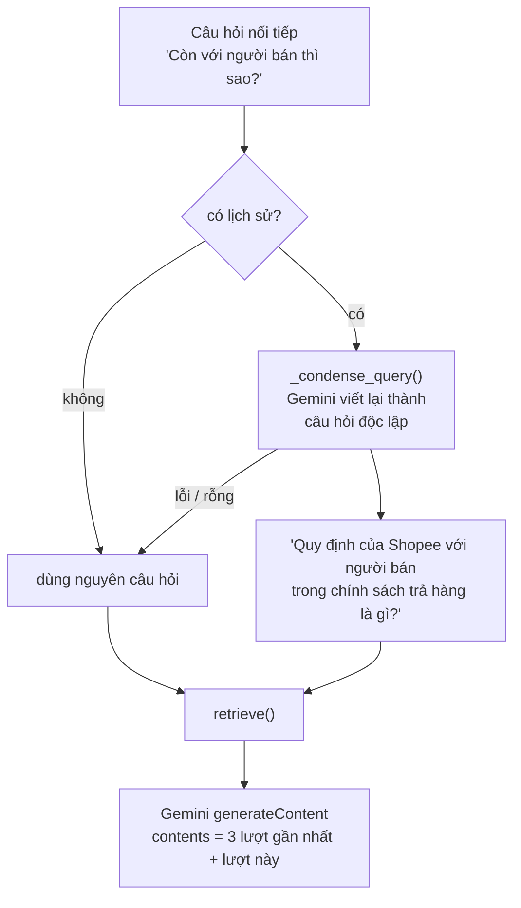

# Bài Tập Nhóm — E-commerce Support RAG Chatbot

## Mục Tiêu

Sau khi hoàn thành bài cá nhân, nhóm ngồi lại để xây dựng **1 trong 2 sản phẩm**:

---

## Yêu cầu 1: Sản phẩm nhóm RAG Chatbot

Xây dựng chatbot trả lời câu hỏi về chính sách thương mại điện tử và hỗ trợ khách hàng liên quan.

**Yêu cầu:**
- Giao diện chat (Streamlit / Gradio / Chainlit)
- Trả lời có citation (dựa trên Task 10)
- Hỗ trợ follow-up questions (conversation memory)
- Hiển thị source documents đã dùng

**Stack gợi ý:**
```
Chainlit/Streamlit → Retrieval (Task 9) → Generation (Task 10) → Display
```

---

## Yêu cầu 2: RAG Evaluation Pipeline

Sử dụng **1 trong 3 framework** sau để evaluate pipeline RAG của nhóm:

### Framework lựa chọn

| Framework | Cài đặt | Đặc điểm |
|-----------|---------|-----------|
| [DeepEval](https://github.com/confident-ai/deepeval) | `pip install deepeval` | Nhiều metric built-in, dễ integrate với pytest |
| [RAGAS](https://github.com/explodinggradients/ragas) | `pip install ragas` | Chuẩn industry cho RAG eval, 3 trục chính |
| [TruLens](https://github.com/truera/trulens) | `pip install trulens` | Dashboard UI, feedback functions mạnh |

### Yêu cầu Evaluation

1. **Tạo Golden Dataset** — tối thiểu 15 cặp Q&A (question, expected_answer, expected_context)
2. **Chạy evaluation** trên toàn bộ golden dataset với các metrics sau:
   - **Faithfulness** — câu trả lời có bám đúng context không?
   - **Answer Relevance** — câu trả lời có đúng câu hỏi không?
   - **Context Recall** — retriever có lấy đủ evidence không?
   - **Context Precision** — trong context lấy về, bao nhiêu % thực sự hữu ích?
3. **So sánh A/B** — chạy eval trên ít nhất 2 config khác nhau (ví dụ: có reranking vs không reranking, hoặc hybrid vs dense-only)
4. **Báo cáo** — bảng điểm + phân tích worst performers + đề xuất cải tiến

Xem code mẫu (DeepEval/RAGAS/TruLens) chi tiết trong `README.md` gốc mục "Yêu cầu 2".

### Deliverable Evaluation

- [ ] File `group_project/evaluation/golden_dataset.json` — 15+ cặp Q&A
- [ ] File `group_project/evaluation/eval_pipeline.py` — script chạy evaluation
- [ ] File `group_project/evaluation/results.md` — bảng điểm + phân tích
- [ ] So sánh A/B ít nhất 2 configs

---

## Yêu Cầu Chung

1. **Tích hợp pipeline** từ bài cá nhân của các thành viên
2. **Demo hoạt động được** trong buổi trình bày (chạy local hoặc deploy)
3. **Evaluation pipeline** chạy được và có báo cáo kết quả
4. **Code push lên repository** chung của nhóm
5. **README** mô tả kiến trúc và phân công (điền bên dưới)

---

## Kiến Trúc Hệ Thống

### Tổng quan luồng



### Tầng UI (bài nhóm)



### Conversation memory (multi-turn)



Lịch sử chỉ gồm các cặp hỏi-đáp **đã trả lời thành công** (`get_history` bỏ lượt lỗi và bỏ câu
hỏi đang xử lý), mỗi message cắt còn 600 ký tự để không lấn chỗ của chunk tài liệu trong prompt.

### Thành phần & tham số

| Thành phần | Lựa chọn | File |
| :-- | :-- | :-- |
| Chunking | recursive, size 800, overlap 100 | [../src/task4_chunking_indexing.py](../src/task4_chunking_indexing.py) |
| Embedding | `text-embedding-3-small`, 1536-dim, L2-normalized | [../src/task4_chunking_indexing.py](../src/task4_chunking_indexing.py) |
| Vector store | ChromaDB persistent, collection `ecommerce_support_docs`, cosine | [../src/task4_chunking_indexing.py](../src/task4_chunking_indexing.py) |
| Dense retrieval | cosine similarity, `score = 1 - distance` | [../src/task5_semantic_search.py](../src/task5_semantic_search.py) |
| Sparse retrieval | `BM25Okapi`, corpus nạp từ ChromaDB | [../src/task6_lexical_search.py](../src/task6_lexical_search.py) |
| Fusion + rerank | RRF `k = 60` rồi Jina `jina-reranker-v2-base-multilingual`; Jina lỗi thì giữ thứ hạng RRF | [../src/task7_reranking.py](../src/task7_reranking.py) |
| Fallback | PageIndex vectorless, ngưỡng `SCORE_THRESHOLD` trên cosine gốc | [../src/task8_pageindex_vectorless.py](../src/task8_pageindex_vectorless.py) |
| Pipeline | `fetch_k = top_k * 3`, gắn nhãn `source = hybrid \| pageindex` | [../src/task9_retrieval_pipeline.py](../src/task9_retrieval_pipeline.py) |
| Generation | Gemini REST `generateContent`, top_p 0.9, 5 chunks, reorder `front + back[::-1]`, citation `[1]..[n]` | [../src/task10_generation.py](../src/task10_generation.py) |
| Conversation memory | 3 lượt gần nhất, condense câu hỏi trước retrieval | [../src/task10_generation.py](../src/task10_generation.py), [../src/ui/state.py](../src/ui/state.py) |
| UI | Streamlit, hiển thị nguồn + `dense_score`, `top_k` chỉnh 1–10 | [../app.py](../app.py), [../src/ui/](../src/ui/) |

### Ba quyết định thiết kế đáng lưu ý

1. **BM25 nạp corpus từ ChromaDB, không đọc lại `.md`.** Dense và sparse vì thế chạy trên cùng
   một tập chunk và cùng `chunk_id` — điều kiện bắt buộc để RRF ghép được kết quả 2 ranker.
2. **Fallback so ngưỡng với điểm cosine gốc**, không phải điểm RRF. Điểm RRF đỉnh ≈ `1/(60+1)`
   ≈ 0.016 bất kể nội dung liên quan hay không; so với nó thì nhánh PageIndex không bao giờ chạy.
   `SCORE_THRESHOLD` trong [../src/task9_retrieval_pipeline.py](../src/task9_retrieval_pipeline.py)
   hiện vẫn là giá trị mẫu `0.3` kèm `TODO` calibrate — cần tự đo trên corpus của nhóm.
3. **UI hiển thị `dense_score`, không hiển thị `rrf_score`.** Nếu hiển thị điểm RRF dạng phần
   trăm, một chunk khớp hoàn hảo vẫn hiện "3% phù hợp". Chunk chỉ do BM25 tìm ra thì ẩn badge
   (BM25 không nằm trong thang `[0,1]`).

---

## Phân Công Công Việc

| Thành viên | MSSV | Nhiệm vụ | Trạng thái |
|-----------|------|----------|------------|
| | | | |
| | | | |
| | | | |
| | | | |

---

## Hướng Dẫn Chạy

```bash
# Cài đặt dependencies
pip install -r requirements.txt

# Chạy app
streamlit run app.py
# hoặc
chainlit run app.py
```

---

## Lưu ý

Hãy giữ lại repo này nếu như bạn học track 3 giai đoạn 2, chúng ta sẽ phát triển tiếp dự án lên knowledge graph để khắc phục các câu hỏi hóc búa khi có các câu hỏi khó.
